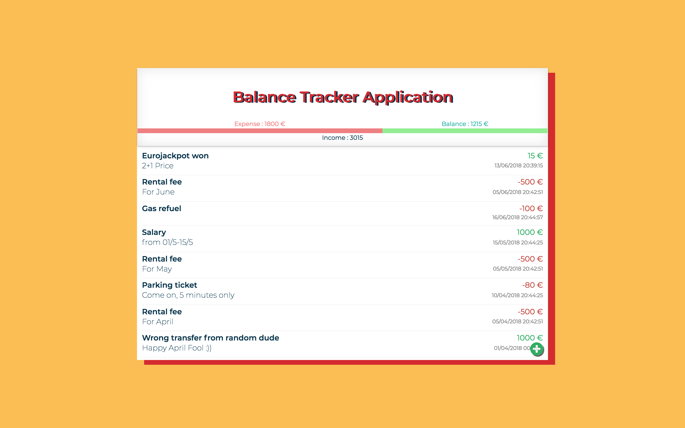

# Acount Balance Application

Acount Balance Application used to track income/expense for daily uses. Click <a href="https://trungh13.github.io/integrify-assignment11-balancetracker/">this </a> for live demo and the screenshot of application below:

## Version
v0.1 ReactJS <a href="https://github.com/trungh13/integrify-assignment11-balancetracker">Source code in master branch</a>.
* Making the application with ReactJS, CSS Modules, react-modal. 
* Change sorting method, can sort coins when searching.
* Deploy it to <a href="https://github.com/trungh13/integrify-assignment11-balancetracker/tree/gh-pages">gh-pages branch </a>using <a href="https://github.com/gitname/react-gh-pages">react-gh-pages</a>
* Responsive design so mobile friendly, cheer :smile: !


## Getting Started

These instructions will get you a copy of the project up and running on your local machine for development and testing purposes. See deployment for notes on how to deploy the project on a live system.

### Prerequisites

**You’ll need to have Node >= 6 on your local development machine** (but it’s not required on the server). You can use [nvm](https://github.com/creationix/nvm#installation) (macOS/Linux) or [nvm-windows](https://github.com/coreybutler/nvm-windows#node-version-manager-nvm-for-windows) to easily switch Node versions between different projects.

### Installing

A step by step series of examples that tell you how to get a development env running

```
git clone https://github.com/trungh13/integrify-assignment11-balancetracker.git

cd integrify-assignment11-balancetracker

npm install
```
---
©2018 Trung Hoang. Visit me on <a href="https://github.com/trungh13/">Github :octocat:</a> 